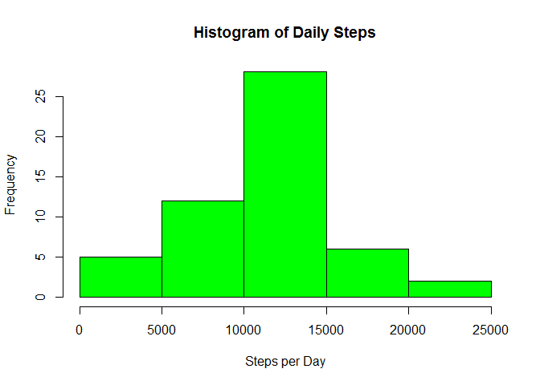
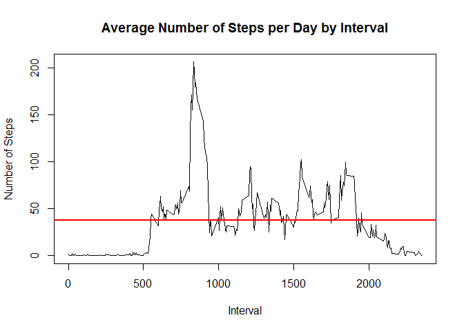
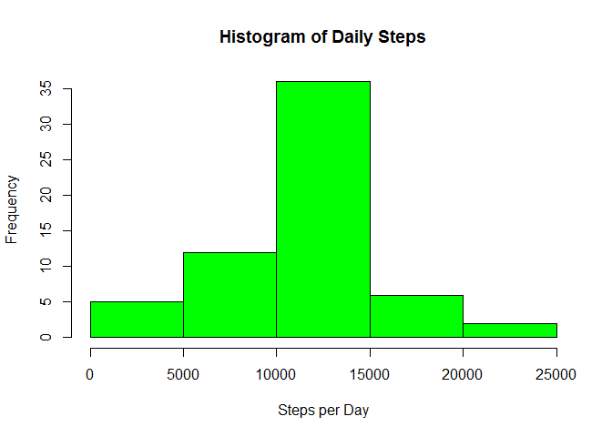

# Reproducible Research: Peer Assessment 1


## Loading and preprocessing the data

* The data need to be loaded and 'date' transformed from a factor to a date variable.


```r
setwd("~/coursera/reproducible_research/project_1")
activity <- read.csv("activity.csv")
activity$date <- as.Date(activity$date)
```


## What is mean total number of steps taken per day?

### 1. Make a histogram of the total number of steps taken each day


```r
# Aggregate steps taken on a given day

activity_agg <- aggregate(steps ~ date, activity, sum)

# Plot the histogram including a horizontal line for the mean
hist(activity_agg$steps, main="Histogram of Daily Steps", xlab="Steps per Day", ylab="Frequency", col="green")
```

 


### 2. Calculate and report the **mean** and **median** total number of steps taken per day


```r
mean_steps <- mean(activity_agg$steps, na.rm=TRUE)
med_steps <- median(activity_agg$steps, na.rm=TRUE)
```

The mean number of steps is 1.0766189\times 10^{4} and the median is 10765.


## What is the average daily activity pattern?

### 1. Make a time series plot (i.e. `type = "l"`) of the 5-minute interval (x-axis) and the average number of steps taken, averaged across all days (y-axis)


```r
# First, generate dataset with the mean steps by interval.
activity_interval <- aggregate(steps ~ interval, activity, mean)

# Generate plot.
plot(activity_interval$interval, activity_interval$steps, type="l", 
     xlab="Interval", ylab="Number of Steps",main="Average Number of Steps per Day by Interval")
abline(h=mean(activity_interval$steps, na.rm=TRUE),col="red", lwd=2)
```

 


###2. Which 5-minute interval, on average across all the days in the dataset, contains the maximum number of steps?


```r
# From previous dataset, extract the maximum steps

max_steps <- activity_interval$interval[which(activity_interval$steps == max(activity_interval$steps))]
```

On average, interval 835 contains the maximum number of steps.


## Imputing missing values

Note that there are a number of days/intervals where there are missing
values (coded as `NA`). The presence of missing days may introduce
bias into some calculations or summaries of the data.

### 1. Calculate and report the total number of missing values in the dataset (i.e. the total number of rows with `NA`s)


```r
num_na <- sum(is.na(activity$steps))
```

There are 2304 missing values.


### 2. Devise a strategy for filling in all of the missing values in the dataset. The strategy does not need to be sophisticated. For example, you could use the mean/median for that day, or the mean for that 5-minute interval, etc.

The missing values will be filled in with the mean for that five minute interval taken from the whole dataset.


### 3. Create a new dataset that is equal to the original dataset but with the missing data filled in.


```r
# If the steps variable in activity is NA, then match it with the dataset average for that interval.
# The interval averages are taken from the activity_interval dataframe. 
activity_nona <- transform(activity, 
                           steps = ifelse(is.na(activity$steps),                              activity_interval$steps[match(activity$interval, activity_interval$interval)], activity$steps))
```

### 4. Make a histogram of the total number of steps taken each day and Calculate and report the **mean** and **median** total number of steps taken per day. Do these values differ from the estimates from the first part of the assignment? What is the impact of imputing missing data on the estimates of the total daily number of steps?

As per the first part of the assignment, but with the base data changed from activity to activity_nona:


```r
# Aggregate steps taken on a given day

activity_aggnona <- aggregate(steps ~ date, activity_nona, sum)

# Plot the histogram including a horizontal line for the mean
hist(activity_aggnona$steps, main="Histogram of Daily Steps", xlab="Steps per Day", ylab="Frequency", col="green")
```

 


```r
mean_stepsnona <- mean(activity_aggnona$steps, na.rm=TRUE)
med_stepsnona <- median(activity_aggnona$steps, na.rm=TRUE)
```

The mean number of steps is 1.0766189\times 10^{4} compared with 1.0766189\times 10^{4} before.

The median is 1.0766189\times 10^{4} compared with 10765 before.

## Are there differences in activity patterns between weekdays and weekends?

For this part the `weekdays()` function may be of some help here. Use
the dataset with the filled-in missing values for this part.

### 1. Create a new factor variable in the dataset with two levels -- "weekday" and "weekend" indicating whether a given date is a weekday or weekend day.


```r
week <- c("Monday", "Tuesday", "Wednesday", "Thursday", "Friday")

# Create if function that labels the entry 'weekday' if it is in the above list, 'weekend' if not.
activity_nona$dow <- as.factor(ifelse(is.element(weekdays(as.Date(activity_nona$date)),week), "Weekday", "Weekend"))
```


### 2. Make a panel plot containing a time series plot (i.e. `type = "l"`) of the 5-minute interval (x-axis) and the average number of steps taken, averaged across all weekday days or weekend days (y-axis). 


```r
# Process dataset to give means by interval:
byinterval <- aggregate(steps ~ interval + dow, activity_nona, mean)

# Use lattice to create a week and weekend plot:
library(lattice)

xyplot(byinterval$steps ~ byinterval$interval|byinterval$dow,
       main="Average Steps per Day by Interval",xlab="Interval", ylab="Steps",
       layout=c(1,2), type="l")
```

 

